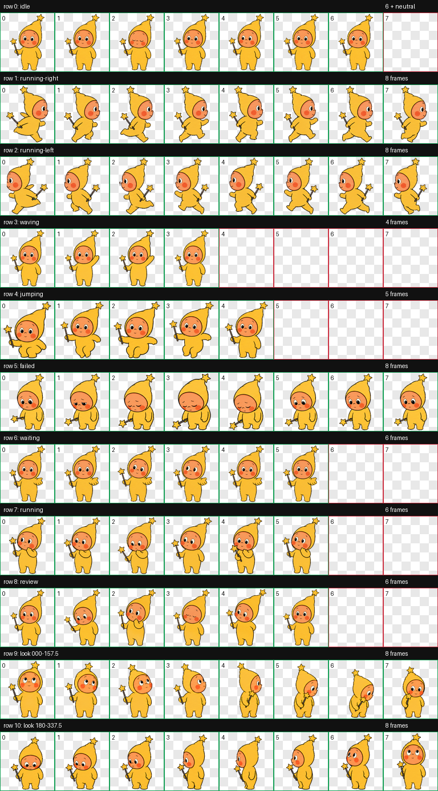

# Xiaoxing (小星) — Codex Pet

A warm little star-guide who turns curiosity into gentle magic.



Xiaoxing is a Codex-compatible v2 animated pet with nine standard animation states and sixteen clockwise look directions. The artwork keeps a warm vintage children’s-book style, with a golden star hood, peach face, rosy cheeks, kind eyes, and a small star wand.

## Preview

| Idle | Running | Waving | Waiting |
| --- | --- | --- | --- |
|  |  |  |  |

## Install

### macOS / Linux

```bash
mkdir -p ~/.codex/pets/xiaoxing
cp pet/pet.json pet/spritesheet.webp ~/.codex/pets/xiaoxing/
```

Restart Codex if Xiaoxing does not appear immediately.

### Manual installation

Copy the contents of the `pet/` directory into:

```text
~/.codex/pets/xiaoxing/
```

The installed directory must contain both files:

```text
xiaoxing/
├── pet.json
└── spritesheet.webp
```

## Compatibility

- Sprite contract: Codex pet v2
- Atlas: `1536 × 2288`
- Cell size: `192 × 208`
- Layout: 8 columns × 11 rows
- Standard animation rows: 9
- Look directions: 16
- `spriteVersionNumber`: `2`

## Quality checks

The published atlas passed:

- v2 atlas geometry and transparency validation
- chroma-edge cleanup validation
- all standard animation-state checks
- four cardinal-direction gates
- three-reviewer blind direction validation
- final visual and motion review

Machine-readable QA results are included in [`qa/`](qa/).

## 中文说明

小星是一只适用于 Codex 的 v2 动画宠物，包含 9 种标准动画状态和 16 个顺时针观察方向。将 `pet/` 文件夹里的两个文件复制到 `~/.codex/pets/xiaoxing/`，然后重新打开 Codex 即可使用。

## License

Xiaoxing is licensed under [Creative Commons Attribution 4.0 International](LICENSE.md).

You may share and adapt the pet, including commercially, as long as appropriate credit is given.

Suggested credit:

```text
Xiaoxing Codex Pet by rixivv, licensed under CC BY 4.0.
```

